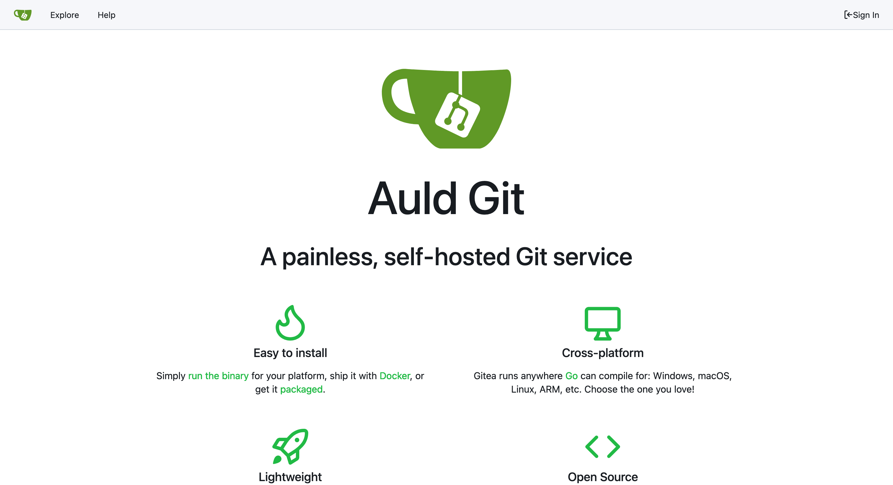
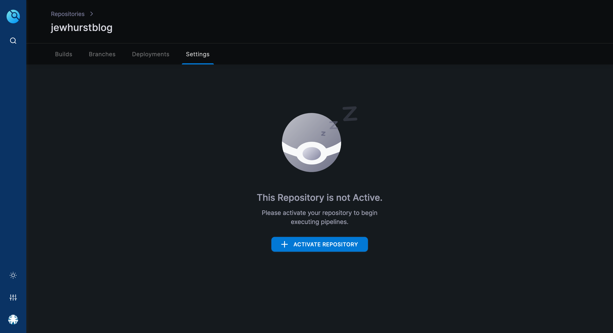
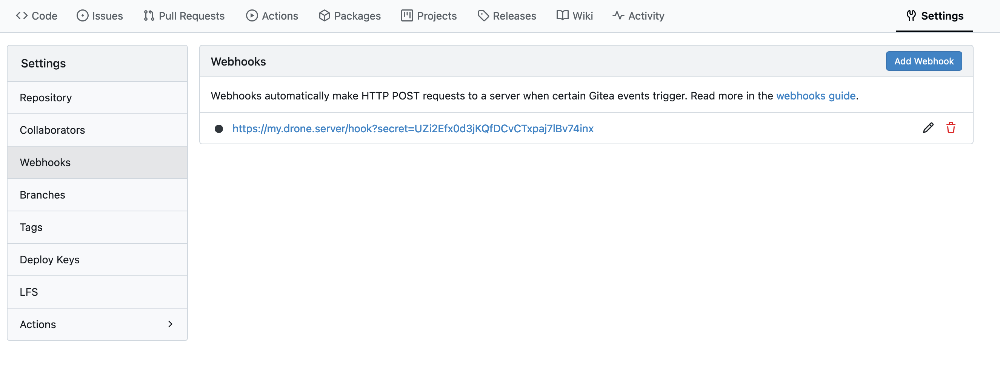
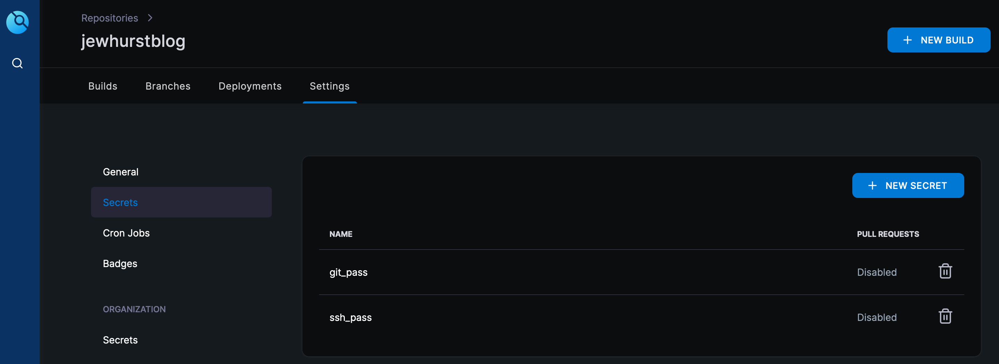
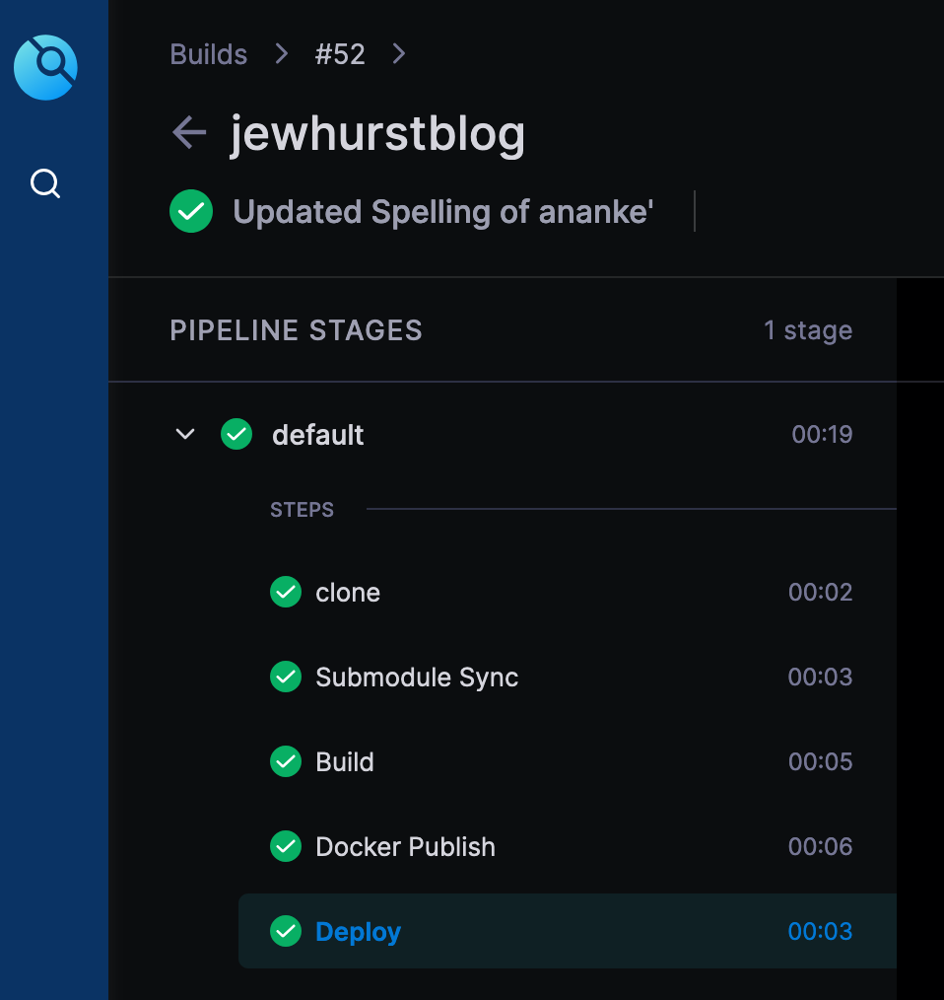
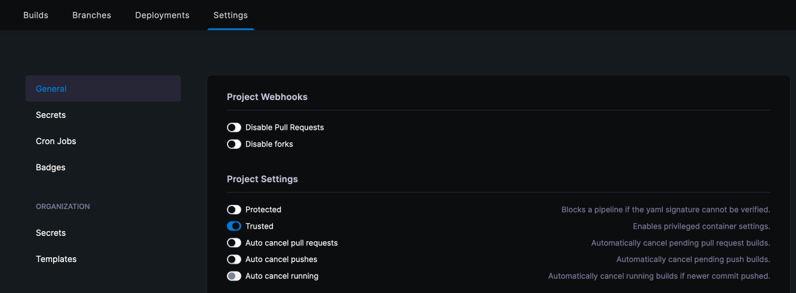

In [my last post](https://www.jewhurst.com/static-website-with-hugo/) I talked about the advantages of Static Site Generators, and moving my blog to Hugo. But that was only the first part of the tale.

Hugo works by converting the content you create in Markdown, and the themes you create (or install) into HTML files, which can be served by a web server. While it does contain it's own Webserver, it's not suitable for Production workloads. This meant that I needed a web server to be able to serve my content the end user (that's you)!

Recall our website directory:
```bash
➜ tree -L3
.
├── archetypes
│   └── default.md
├── assets
├── content
│   ├── _index.md
│   └── posts
│       ├── _index.md
│       └── a-new-blog.md
├── data
├── hugo.toml
├── i18n
├── layouts
├── public
├── static
└── themes
    └── ananke
        ├── CHANGELOG.md
        ├── LICENSE.md
        ├── README.md
        ├── archetypes
        ├── assets
        ├── config
        ├── exampleSite
        ├── go.mod
        ├── gohugo-theme-ananke.code-workspace
        ├── i18n
        ├── images
        ├── layouts
        ├── package-lock.json
        ├── package.hugo.json
        ├── package.json
        ├── resources
        ├── stackbit.yaml
        ├── static
        └── theme.toml
```
When the `hugo` command is executed, it takes the CSS, Javascript and static HTML from `themes` and combines it with the the content in `content` to create a website which is stored in a newly created folder `public`.
```bash
➜ hugo
Start building sites …
hugo v0.135.0+extended darwin/arm64 BuildDate=2024-09-27T13:17:08Z VendorInfo=brew

                   | EN
-------------------+-----
  Pages            | 11
  Paginator pages  |  0
  Non-page files   |  0
  Static files     |  1
  Processed images |  0
  Aliases          |  1
  Cleaned          |  0

Total in 57 ms
```
```bash
➜ tree public
public
├── 404.html
├── ananke
│   └── css
│       ├── main.css.map
│       └── main.min.css
├── categories
│   ├── index.html
│   └── index.xml
├── images
│   └── gohugo-default-sample-hero-image.jpg
├── index.html
├── index.xml
├── posts
│   ├── a-new-blog
│   │   └── index.html
│   ├── index.html
│   ├── index.xml
│   └── page
│       └── 1
│           └── index.html
├── sitemap.xml
└── tags
    ├── index.html
    └── index.xml
```
Traditionally, one would have to copy this folder into a webserver, which makes updating a blog quite a process, as you would have to write your post, render the HTML and then push that to the webserver, either overwriting or archiving your old content along the way.

## Enter Git

[Git](https://en.wikipedia.org/wiki/Git) is a very common version control system - it acts as a database for changes to one, or many, files and folders. Git relies on a server to store the changes - [Github](https://https://github.com/) is an example of one with a web front-end, so that you can interact with your repositories in a graphical manner, as well as on the command-line.

The first step in automating away the process of deploying changes to the blog was to start storing the files somewhere that could be accessed by other tools (aka: not my laptop). [Gitea](https://about.gitea.com/) is a free Git software (a little like Github, but more lightweight) which can be hosted in a container, which provides a lot of the functionality of Github (or [GitLab](https://about.gitlab.com/) - another free Git system) but without some of the Enterprise grade features.

Deploying Gitea was very simple, as I already have a [Docker](https://docs.gitea.com/installation/install-with-docker) infrastructure. Although I use [Portainer](https://www.portainer.io/) to admin my docker infrastructure, it can be spun up with a simple docker-compose file:

```yaml
version: "3"

networks:
  $YOUR-NETWORK:
    external: (true | false)

services:
  server:
    image: gitea/gitea:latest
    container_name: gitea
    environment:
      - USER_UID=1000
      - USER_GID=1000
    restart: always
    networks:
      - $YOUR-NETWORK
    volumes:
      - /data/gitea:/data
      - /etc/timezone:/etc/timezone:ro
      - /etc/localtime:/etc/localtime:ro
    ports:
      - "3000:3000"
      - "222:22"
```
You can choose to back this off to an SQL Database (MySQL and PostgreSQL are supported) but for my purposes I'm just using SQLite, which is contained in the `/data/gitea` volume. Configuring takes only a moment to set up a site name, and I also configured my reverse proxy and DNS to ensure I could access it via domain name, and via TLS. I decided to name mine after myself.



Creating an empty repository is straightforward, so I could quickly start pushing my website files to the repo. I specifically didn't want to push to generated HTML, so I started by creating a `.gitignore` file, which defines folders, files and filetypes to be excluded from the repo:

```bash
➜ cat .gitignore
.DS_Store
public/
```
Next I initiated my local folder and connected it to Gitea:
```bash
➜ git init
Initialized empty Git repository in /Users/stan/hugo/jewhurstdotcom/.git/
```
```bash
➜ git remote add origin https://my.git.server/stan/jewhurstdotcom.git
```
```bash
➜ git add .
➜ git commit -m "First Commit"
[main (root-commit) 07f991c] First Commit
 25 files changed, 937 insertions(+)
 create mode 100644 .gitmodules
 create mode 100644 .hugo_build.lock
 create mode 100644 archetypes/default.md
 create mode 100644 content/_index.md
 create mode 100644 content/posts/_index.md
 [...]

➜ git push -u origin main
Enumerating objects: 25, done.
Counting objects: 100% (25/25), done.
Writing objects: 100% (25/25), 53 KiB bytes | 217.00 KiB/s, done.
Total 25 (delta 6), reused 0 (delta 0), pack-reused 0 (from 0)
remote: . Processing 1 references
remote: Processed 1 references in total
To https://my.git.server/stan/test.git
 * [new branch]      main -> main
branch 'main' set up to track 'origin/main'.
```
And now my website blog content was being tracked within a local Git repo, keeping it private and secure.

Now I had to figure out how I would get the files from here to a webserver, in a way which was repeatable, and required little interaction from me.

## Drone.io

After a bit of Googling around, I came across [Drone.io](https://drone.io). Drone is a CI/CD tool similar to Jenkins, only it is free and lightweight. It has integrations for many popular Git platforms includuing GitHub, GitLab, Bitbucket and Gitea.

For those not familiar with CI/CD, most software will have two parts. First is the [CI/CD server](https://docs.drone.io/server/provider/gitea/), which handles the communications with repositories, authentication and pipeline execution. Second are the [runners](https://docs.drone.io/runner/docker/installation/linux/), which handle orchestration of the various components needed to execute the pipeline. As this will only be handling a small amount of automation, I only need one runner. 

Drone authenticates through Gitea using OAuth - Gitea allows you to create trusted applications from **Settings > Applications**. This yields a **Client ID** and **Client Secret**, which we pass to the docker container. I use raw environment variables to hold this, but within production deployments, one might [use a secret](https://docs.docker.com/compose/how-tos/use-secrets/) for added security. A second secret is also configured, which is used to authenticate RPC calls from Drone to its runners. Drone suggest using `openssl` to generate this:

```bash
➜ openssl rand -hex 16
bea26a2221fd8090ea38720fc445eca6
```

I've deployed drone with a FQDN, but it can work with an IP Address. What's important is that the IP doesn't change, as Gitea needs to maintain a list of trusted sources for the OAuth call. As such, your docker networks should be set up correctly for your needs. Another element missing from Drone's documentation is the `DRONE_USER_CREATE` variable. In order to have administrative rights within Drone, this should be set to your Gitea username.

```yaml
version: "3"

networks:
  $YOUR-NETWORK:
    external: (true | false)

services:
  server:
    image: drone/drone:latest
    container_name: drone
    environment:
      - DRONE_GITEA_SERVER=https://my.git.server/
      - DRONE_GITEA_CLIENT_ID=$CLIENT-ID-FROM-GITEA
      - DRONE_GITEA_CLIENT_SECRET=$CLIENT-SECRET-FROM-GITEA
      - DRONE_RPC_SECRET=$GENERATED-RPC-SECRET
      - DRONE_SERVER_HOST=my.drone.server
      - DRONE_SERVER_PROTO=https
      - DRONE_USER_CREATE=username:stan,admin:true
    restart: always
    networks:
      - $YOUR-NETWORK
    volumes:
      - /var/lib/drone:/data
      - /etc/timezone:/etc/timezone:ro
      - /etc/localtime:/etc/localtime:ro
    ports:
      - "80:80"
      - "443:443"
```
You should be able to navigate to your drone installation and log in - the login page should redirect your to Gitea to authenticate.

Next we deploy the runner. The configuration is slightly less complicated, but there are two important elements to note. The first is to *mount the docker socket into the runner container* - the runner spins up additional docker containers to complete the steps of the automation, and so must be able to communicate with the underlying docker host.

The second element is the `DRONE_RUNNER_VOLUMES` variable, which is not convered in the Drone runner deployment documentation (but can be found [here](https://docs.drone.io/runner/docker/configuration/reference/drone-runner-volumes/)). This variable states the volumes that should be mounted into containers which the runner orchestrates - so if you plan to build docker images as part of a pipeline step, this should be set to mount the docker socket into the runner's containers.

```yaml
version: "3"

networks:
  $YOUR-NETWORK:
    external: (true | false)

services:
  server:
    image: drone/drone-runner-docker:latest
    container_name: drone-runner
    environment:
      - DRONE_RPC_HOST=my.drone.server
      - DRONE_RPC_PROTO=https
      - DRONE_RPC_SECRET=$GENERATED-RPC-SECRET
      - DRONE_RUNNER_CAPACITY=2  # How many pipelines can be run simultaneously
      - DRONE_RUNNER_NAME=my-drone-runner
      - DRONE_RUNNER_VOLUMES=/var/run/docker.sock:/var/run/docker.sock
    restart: always
    networks:
      - $YOUR-NETWORK
    volumes:
      - /var/run/docker.sock:/var/run/docker.sock
      - /etc/timezone:/etc/timezone:ro
      - /etc/localtime:/etc/localtime:ro
    ports:
      - "3000:3000"
```

Phew! That was a bit of work, but when all configured correctly, you should see a sucess message on the console of the drone runner:

```bash
➜ docker logs droner-runner

time="2024-10-04T13:42:38Z" level=info msg="starting the server" addr=":3000"
time="2024-10-04T13:42:38Z" level=info msg="successfully pinged the remote server"
time="2024-10-04T13:42:38Z" level=info msg="polling the remote server" arch=amd64 capacity=2 endpoint="https://my.drone.server" kind=pipeline os=linux type=docker
```

With all the infrastructure in place, we can get to configuring our pipline. Pipelines in Drone are a YAML file called `.drone.yml` which is stored in the root of the repository. Before I started to create this file, I defined the following high level pipeline, so I knew what I was trying to accomplish.

1. Pull the Git repo
2. Update the theme (Git submodules are not automatically downloaded)
3. Build the website (Run the Hugo command)
4. Build an NGINX docker container and place the generated files into it
5. Push the docker container to Gitea registry
6. Deploy the docker container, replacing any existing container

This helped me identify that I would also need a Dockerfile to define the container I wanted to build, so I created that first. I knew that `hugo` rendered the website to the `public/` directory, and we wanted those files to be served by NGINX:

```docker
# Use Nginx as the base image
FROM nginx:alpine

# Copy Hugo's generated site from the public folder to Nginx's web root
COPY public /usr/share/nginx/html
```

With the Dockerfile in place, I started on the pipeline. The first stage of any pipeline is to pull the repo, which is passed to drone via a webhook when a commit is made. The Webhook is set up automatically when you connect drone to your Gitea repo.




Finally we can build the drone pipeline file

```yaml
kind: pipeline
type: docker    # As I'm using a docker runner 
name: default

steps:
# Update the theme
- name: Submodule Sync
  image: alpine/git   # What docker image to use to complete the step
  commands:           # What commands to run
  - git submodule update --init --recursive

# Build the Website Files
- name: Build
  image: alpine
  commands:           # Installing the hugo package and building the site
  - apk add --no-cache --repository=https://dl-cdn.alpinelinux.org/alpine/edge/community hugo
  - hugo

# Build the Docker image with Nginx
- name: Docker Build and Public
  image: plugins/docker:latest  # Drone plugin to run docker commands
  settings:
    username: stan
    password:
      from_secret: git_pass     # Git Password to push image to registry
    repo: my.git.server/stan/jewhurstblog
    registry: my.git.server
    tags:                       # Tag with latest, and with build number
      - latest
      - ${DRONE_BUILD_NUMBER}

# Deploy the image to the Docker host
- name: Deploy
  image: appleboy/drone-ssh   # SSH image to connect to docker host
  settings:
    host: my.docker.host
    username: stan
    password: 
      from_secret: ssh_pass   # Password for Docker Server
    port: 22
    command_timeout: 60s
    script:
      - sudo docker pull my.git.server/stan/jewhurstblog:latest
      - sudo docker stop jewhurstblog || true
      - sudo docker rm jewhurstblog || true
      - |
        sudo docker run -d --name jewhurstblog \
        --network "External" \
        --ip $STATIC-IP \
        -p 80:80 \
        my.git.server/stan/jewhurstblog:latest
```
This pipeline uses Drone secrets, which can be configured in the web interface:



With everything in place, we can test the pipeline by pushing to our repository



And test by visiting the IP of your container or, since my reverse proxy was pointing at it, visit [https://www.jewhurst.com](https://www.jewhurst.com)!

/SJ

> A small note - I had to enable a trust in Drone to allow the Docker steps to work correctly. This is why it is important you have admin credentials within Drone as otherwise this menu is hidden. This is not recommended if you are running drone publically or on a shared infrastructure.

> 