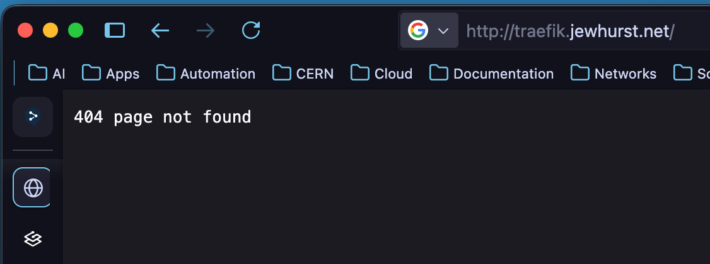
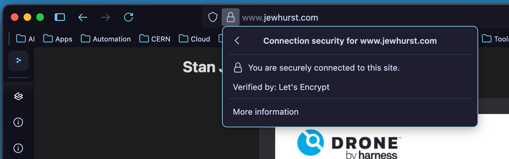

It's hard to believe it has been almost a year since the last post I wrote - and what a year it has been. Since my [last post](https://www.jewhurst.com/build-automation-with-drone/) I secured a dream job with CERN, sold my Piano (😭), tore down my whole self-hosting infrastructure, moved halfway across Europe to Geneva, started (re)learning French, made a bunch of new friends and managed to find an apartment in a place renowned for it's crazy housing market.

Six months into this upheaval and I'm finally starting to settle, which means, as well as continuing to study for my piano diploma, I have to rebuild my self-hosting infrastructure. This gives me an opportunity to change the way I do things, as well as update my infrastructure and software choices.

One of those choices was moving from [NGINX Proxy Manager](https://nginxproxymanager.com/), a piece of software which has served me well for many years, to something a little more modern. NPM is an excellent tool - stable, customisable, and performant - but it is quite manual. This is absolutely great if you are deploying a few servers here or there, and generally not making many changes, but I plan to be spinning up a lot of containers on the fly to test out different software, and this would mean manually configuring them in NPM (even if the GUI is rather lovely to work with).

I did some research into other options, coming across [HA Proxy](https://www.haproxy.org/), [Caddy](https://caddyserver.com/) and finally [Traefik](https://traefik.io/traefik). I've known about Traefik for a while, with many people in the [r/selfhosted](https://reddit.com/r/selfhosted) being big fans but I never seemed to be able to settle enough to learn how it worked, and how it needed to be configured. The [documentation](https://doc.traefik.io/traefik/reference/routing-configuration/other-providers/docker/) is certainly a little overwhelmeing if you're someone like me who wants it all laid out straight, but I took a few hours this weekend and finally sat down to learn and understand it.

## The Basics

Traefik has the capability to hook directly into the docker socker (`/var/run/docker.sock`) which means that it becomes aware of your containers from the moment they are deployed, and can enumerate most of the configuration required to route traffic towards it. Quite usefully it can also support multiple networks, so if you are like me and use **macvlan** networks (which allow the host to use a MAC and IP address on the host's local subnet) as well as running some containers on **bridge** networks, it can support them all simultaneously.

Traefik works by defining a **Router** and at least one **Service** per container. In general if you are exposing one port, a single router and a single service will be defined.

```
    ----------     -----------     -------
--->| Router |---->| Service |---->| App |
    ----------     -----------     -------
```
This might seem a tad redundant (in fact, it quite literally is) but this allows a single router to handle multiple application instances (via multiple services), providing load-balancing and resiliency. That, however, is more than we need.

Because traefik knows about our containers, we're able to define Router and Service details simply by adding labels to our containers. Traefik reads these labels and dynamically creates the configuration, saving us the headache of writing it, or poking around in a GUI each time we want to start up a container and make it reachable via DNS.

## Traefik.yaml

Traefik does still require a few base configuration parameters - if it is launched using a [Docker Compose](https://doc.traefik.io/traefik/expose/docker/) file, all of these can be defined as attributes of a `command:` mapping. However, if you're like me and like to store things in case something goes wrong one day, you can use a `traefik.yaml` file mounted to `/etc/traefik.yaml` inside your container.

```yaml
entryPoints:
  web:
    address: :80
  websecure:
    address: :443
    http:
      tls: {}

providers:
  docker: {}
```
The most basic version of this file simply defines the **provider** and the **entryPoints** to your reverse proxy - i.e. where should it look for applications and where should it expect clients to connect to. In this case we define **docker** as our provider and two entryPoints - port 80 as `web` and port 443 as `websecure`. 

> Note that under the `websecure` endpoint we define an additional property - `http.tls` - this enables TLS for every router attached to it. 

To test that it is listening, I created a DNS entry to point toward the IP of the Reverse Proxy:



While this looks like something is broken, it demonstrates that Traefik is listening, but just doesn't know where to forward the traffic on to.

Next up was configuring TLS by default - for this we have to configure all HTTP traffic to be redirected to HTTPS. Furthermore, if we want our sites to not throw **Insecure** warnings, we need to set up a method for provisioning certificates. Thankfully, Traefik fully integrates support for [Let's Encrypt](https://letsencrypt.org/) via the [ACME Protocol](https://en.wikipedia.org/wiki/Automatic_Certificate_Management_Environment).

We can extend the `web:` entrypoint with `http.redirections.entryPoint` to force all traffic to the `websecure:` endpoint.

```yaml
entryPoints:
  web:
    address: :80
    http:
      redirections:
        entryPoint:
          to: websecure
          scheme: https
          permanent: true
```
And to enable the automatic generation of certificates we use [`certificateResolvers.<name>.acme`](https://doc.traefik.io/traefik/reference/install-configuration/tls/certificate-resolvers/acme/). In my case I named it `le`. 

> Note that the case is important in these keys.

```yaml
certificatesResolvers:
  le:
    acme:
      email: <email>
      storage: /letsencrypt/acme.json
      httpChallenge:
        entryPoint: web
```
You'll need to create and mount the storage location into your container. I'm using the `httpChallenge` to validate the configuration, as Traefik will automatically host the challenge on the `web` entrypoint, but [there are others](https://doc.traefik.io/traefik/reference/install-configuration/tls/certificate-resolvers/acme/#the-different-acme-challenges) that can be used.

## Labeling the containers

The last part is surprisingly the easiest - setting up your containers to be served by Traefik. For this I needed only three labels:

The first defines the DNS hostname of the router (i.e. where you want your application to be reachable). 

>Note the backticks ``` ` ``` in use - these cannot be apostophes ` ' `.

`traefik.http.routers.<name>.rule` = ```Host(`my-host.my-domain.net`)```

The second defines the port that the service should be attached to. Note that your Router and Service don't need to have the same name, but as I'm only defining one Router and one Service, keeping the same makes it easier.

`traefik.http.services.<name>>.loadbalancer.server.port` = `8080`

And finally, we tell the router what provider to use to get it's TLS certificate.

`traefik.http.routers.<name>.tls.certresolver` = `le`

And that's it! Our container should be up and running with a valid Let's Encrypt TLS certificate.

