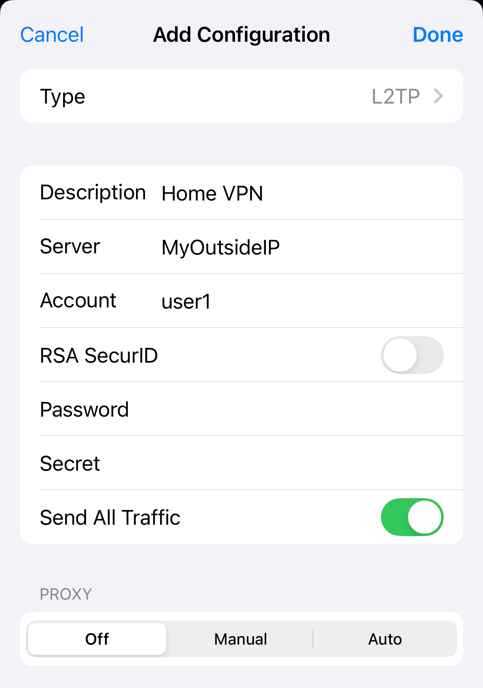

Remote access to my Home Lab and various other assets has always been something I've secured with HTTPS - I've used multiple technologies from nginx remote proxies to HAProxy with SSL Offloading (this works really well when integrating with LetsEncrypt with multiple back end services); however after picking up my new iPhone 11 Pro, I wanted a good way to secure my general browsing when out and about on public WiFi as well as a more straightforward method of gaining CLI access to my various assets.

I've not spoken about my use of [VyOS](https://www.vyos.io/) yet, but as an alternative to the time-based licensing on Cisco CSR1000v (and its kind of crazy VM requirements) I decided to migrate my Edge Routing to VyOS which runs in a small sized VM, on practically any CPU which supports virtualisation, and yet can still provide decent encryption speeds. I also implemented this on my remote vServer, so I could extend my Home network into the Cloud.

Being a network engineer raised in a Cisco environment, IPSec has always been my tunnelling protocol of choice, but with a remote endpoint such as an iPhone, with a dynamic IP, I felt this could be a tad clumsy to set up. Likewise, IKEv2, while supported by iOS natively, is entirely undocumented from a VyOS standpoint for a dynamic remote client, such as a phone (and older versions of VyOS have had issues with IKEv2 support). Unlike a lot of Routers - as it is Debian based - VyOS has native support for OpenVPN but I wanted something native to make it easier to deploy - which left me with L2TP.

L2TP on it's own is not a very secure protocol. In fact, it's entirely insecure, which led to the creation of [RFC3193][1] which denotes a methodology for securing L2TP with IPSec. I was a tad concerned about the security of this, as the RFC denotes that either 3DES or AES can be used, but I figured I would be able to configure that within VyOS, and continued on my merry way.

The configuration was actually super easy - L2TP is a supported protocol within VyOS, and their command line interface is nice and straightforward to use. I'm going to use a VPN range of **10.66.66.1 - 10.66.66.6**. My Outside interface will be **pppoe0**. First we enable IPSec on the outside interface, enable NAT Traversal and define the networks we're allowing:

```bash
set vpn ipsec ipsec-interfaces interface pppoe0
set vpn ipsec nat-traversal enable
set vpn ipsec nat-networks allowed-networks 10.66.66.0/29
```

Next, we simply configure L2TP the way we like it, including authentication, users, passwords and addresses for clients:

```bash
set vpn l2tp remote-access description iOSL2TP
set vpn l2tp remote-access authentication mode 'local'
set vpn l2tp remote-access authentication local-users username user1 password 5ome$ecur3Pa$5
set vpn l2tp remote-access client-ip-pool start 10.66.66.1
set vpn l2tp remote-access client-ip-pool stop 10.66.66.6
set vpn l2tp remote-access dns-servers server-1 10.10.10.5
set vpn l2tp remote-access dns-servers server-2 8.8.8.8
set vpn l2tp remote-access ipsec-settings authentication mode 'pre-shared-secret'
set vpn l2tp remote-access ipsec-settings authentication pre-shared-secret A12DigitPass
set vpn l2tp remote-access ipsec-settings ike-lifetime '3600'
set vpn l2tp remote-access outside-address 'MyOutsideIP'
```

There are a couple of things about the configuration above, but we'll start with the elephant in the room - while you can configure this on any VyOS router, you need to specify your outside IP, which means if you don't have a static IP, _you're gonna have a bad time._ Some UK ISPs do offer static IPs to home users, such as Zen, Cerberus and PlusNet. 

Secondly, you may notice that my DNS Server 1 IP is an internal IP - that's my PiHole DNS server which means that my VPN enabled iPhone won't have to deal with those bandwidth consuming adverts (especially as they screw up mobile web browsing so much). It also means that I can hit my internal hosts using DNS.

There is one final piece of configuration, and that is to make sure that the IPs can reach the internet, so we tweak NAT to take that into account:

<pre class="wp-block-code"><code>set nat source rule 100 outbound-interface 'pppoe0'
set nat source rule 100 source address 10.66.66.0/29
set nat source rule 100 translation address masquerade</code></pre>

With that complete, configuring the iPhone is easy, adding in your outside IP (or DNS), username, password, and PSK:



And when we spin it up, we can confirm on the CLI:

```bash
stan@home-vyos:~$ show vpn remote-access
Active remote access VPN sessions:

User            Proto Iface     Tunnel IP       TX byte RX byte  Time
----            ----- -----     ---------       ------- -------  ----
user1           L2TP  l2tp0     10.66.66.1        6.0K    9.7K  00h00m02s
```

You may remember earlier I mentioned that I wasn't sure how secure L2TP/IPSec actually was, and you can see that VyOS gives no options to configure the Phase 1 or Phase 2 SAs. Thankfully, it does have a way of showing some detail on the IPSec connection being used:

```bash
stan@home-vyos:~$ show vpn ipsec sa verbose
[..snip..]
Connections:
remote-access:  my.ip.add.ress...%any  IKEv1, dpddelay=15s
remote-access:   local:  [my.ip.add.ress] uses pre-shared key authentication
remote-access:   remote: uses pre-shared key authentication
remote-access:   child:  dynamic[0/l2f] === dynamic TRANSPORT, dpdaction=clear
Security Associations (2 up, 0 connecting):
remote-access[109]: ESTABLISHED 31 seconds ago, my.ip.add.ress[my.ip.add.ress]...82.132.242.151[10.5.202.100]
remote-access[109]: IKEv1 SPIs: 6f77acf533823322_i 5516f8dae8156886_r*, rekeying disabled
remote-access[109]: IKE proposal: AES_CBC_256/HMAC_SHA1_96/PRF_HMAC_SHA1/MODP_1024
remote-access{717}:  INSTALLED, TRANSPORT, reqid 19, ESP in UDP SPIs: c050470e_i 0da3faea_o
remote-access{717}:  AES_CBC_256/HMAC_SHA1_96, 1343 bytes_i (24 pkts, 5s ago), 1992 bytes_o (25 pkts, 5s ago), rekeying disabled
remote-access{717}:   my.ip.add.ress/32[udp/l2f] === 82.132.242.151/32[udp/61545]
```

We're using IKEv1 with AES256-CBC Encryption, SHA1 Hashing with IPSec Phase 2 using ESP-AES256-CBC and SHA1 Hashing - which I think is quite secure enough to be getting on with.

 [1]: https://tools.ietf.org/html/rfc3193