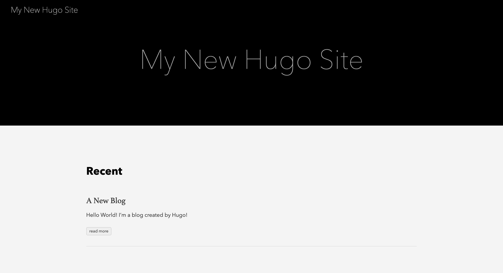
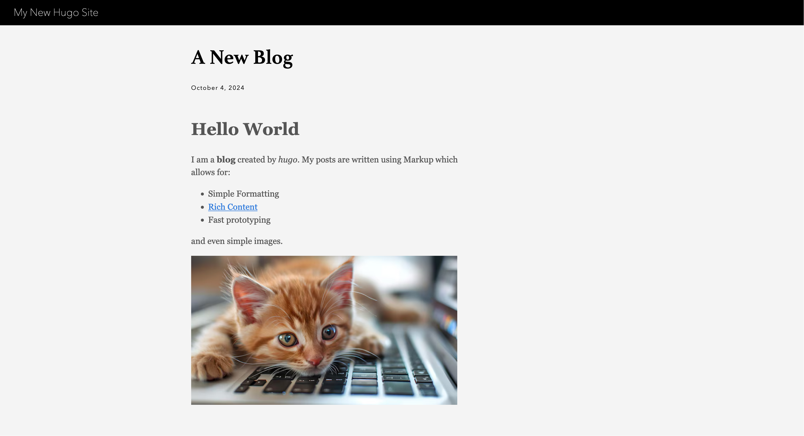

It's a well known fact (by those who visit this site) that my blog posts are few and far between. When COVID rolled around I thought I'd finally have an opportunity to work on some fun tech projects, but none of them ever seemed to be worth writing about. So I decided to do something that was.

This blog has always served more as my documentation library in recent years - usually filled with corner case issues or small personal tech projects. But in the many years I've owned it, I've lost more blog posts and images than I've saved and Wordpress (the platform I was using) just seems to have got more and more bloated and slow.

Most of my applications now run in docker containers and while wordpress was one of them, it required an SQL DB to be running alongside it. And performance just never seemed to be what it was when it was running on bare metal - so I started to look about for replacements which is when I learned about **Static Site Generators**. 

In short, a static site generator takes a bunch of input files (text, html, code) and builds them into a set of static pages (much like the websites of old) which can be pushed to a web server. This results in a very fast website, which is very lightweight.

There are several different tools out there in order to achieve this including:

* [Hugo](https://gohugo.io/)
* [Gatsby](http://gatsbyjs.org/)
* [Jekyll](https://jekyllrb.com/)
* [Next.js](https://nextjs.org/)

For my blog, I decided to go with Hugo. I liked that there was a good amount of themes available for it, and that it used [Markdown][1] as the input format for posts - a formatting language I use on a daily basis when I'm writing documentation or runbooks - meaning it should be a lot easier to start documenting and posting more.


One reason static site generators have become popular recently is that they work well as part of build pipelines - you run one command on a directory, and it spits out html which can be copied to a server, or pushed to the cloud. It also means you can maintain your entire website from a git repository (who needs a backend when you have [VSCodium](https://vscodium.com/)).

Hugo is available as a CLI tool, and the wonderful folks over at [Homebrew](https://brew.sh/) had already packages available for macOS, which means installation was as simple as:

```bash
➜ brew install hugo
```

Getting a new site created is another single command

```bash
➜ hugo new site jewhurstdotcom
Congratulations! Your new Hugo site was created in /Users/stan/hugo/jewhurstdotcom.
```

The folder layout is a bit confusing at first, but there are only a few parts needed to get up and running, those being the `hugo.toml` file and the `content` and `themes`directories.

```bash
➜ tree jewhurstdotcom
jewhurstdotcom
├── archetypes
│   └── default.md
├── assets
├── content
├── data
├── hugo.toml
├── i18n
├── layouts
├── static
└── themes
```

Reading the [documentation](https://gohugo.io/getting-started/directory-structure/), however, is necessary to understand exactly what you need to put in each of these folders, in order to allow the site to build properly.

Another area I struggled with was the themes, as some have not been well maintained, or are missing steps from their documentation which might seem obvious to existing users of Hugo, but which took some time to troubleshoot. I eventually settled on the theme [paperModX](https://github.com/reorx/hugo-PaperModX) thanks in part to a suggestion from [a good friend](https://chrisbt.me/).


Once you have chosen a theme, they are quite easy to install. I followed the documentation and installed it as a git submodule, which makes updating it a breeze, and works a lot better if you plan to store you website in a git repository (more on that in the next post).

> For the example below I'm using a slighly more "out-of-the-box" theme

```bash
➜ git init
Initialized empty Git repository in /Users/stan/hugo/jewhurstdotcom/.git/

➜ git submodule add https://github.com/theNewDynamic/gohugo-theme-ananke.git themes/ananke
Cloning into '/Users/stan/hugo/jewhurstdotcom/themes/ananke'...
remote: Enumerating objects: 2818, done.
remote: Counting objects: 100% (247/247), done.
remote: Compressing objects: 100% (148/148), done.
remote: Total 2818 (delta 122), reused 190 (delta 86), pack-reused 2571 (from 1)
Receiving objects: 100% (2818/2818), 4.61 MiB | 11.85 MiB/s, done.
Resolving deltas: 100% (1555/1555), done.
```

The `hugo.toml` file contains all the configuration for the site. It is read when the site is built and so it needs to know where to look for the theme (it defaults to themes/):

```toml
baseURL = 'https://example.org/'
languageCode = 'en-us'
title = 'My New Hugo Site'
theme = 'ananke'
```

TOML was a new file format for me, but works a little like YAML. That being said, you can format the file as TOML, YAML or JSON, and Hugo will detect it based on the file suffix. Lastly, we can use hugo to create some content.

```bash
➜ hugo new content content/posts/a-new-blog.md
Content "/Users/stan/hugo/jewhurstdotcom/content/posts/a-new-blog.md" created
```

Taking a look at what we created, we get our first view of Hugo's "Front Matter", which is essentially the configuration and meta data for the post:

```bash
➜ cat content/posts/a-new-blog.md
+++
title = 'A New Blog'
date = 2024-10-04T16:25:33+01:00
draft = true
+++
```

Content can be added after the front matter, and most Markdown is supported (some themes enable extended Markdown support). Hugo also contains its own development server, to allow you to preview the site while it's being developed. This is invoked quite simply with:

```bash
hugo server -D
```

in the case the **-D** dicatates that the server should also render draft posts (which would usually be ignored).

```bash
➜ hugo server -D

Watching for changes in /Users/stan/hugo/jewhurstdotcom/{archetypes,assets,content,data,i18n,layouts,static,themes}
Watching for config changes in /Users/stan/hugo/jewhurstdotcom/hugo.toml, /Users/stan/hugo/jewhurstdotcom/themes/ananke/config/_default
Start building sites …

                   | EN
-------------------+-----
  Pages            | 11
  Paginator pages  |  0
  Non-page files   |  0
  Static files     |  1
  Processed images |  0
  Aliases          |  1
  Cleaned          |  0

Built in 31 ms
Environment: "development"
Serving pages from disk
Running in Fast Render Mode. For full rebuilds on change: hugo server --disableFastRender
Web Server is available at http://localhost:1313/ (bind address 127.0.0.1)
Press Ctrl+C to stop
```

The hugo server actively watches for file changes ands re-renders the site, so that you can preview changes in real-time.



And we can click on our blog entry for a full view



This post barely scratches the surface - Hugo does seem to be incredibly powerful, even if it has a bit of a learning curve. I have also fully integrated my website into a build process, but I shall save that for the next post (draft: true).

/SJ

[1]: https://www.markdownguide.org/getting-started/
